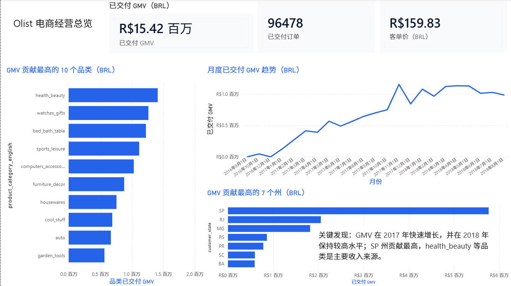
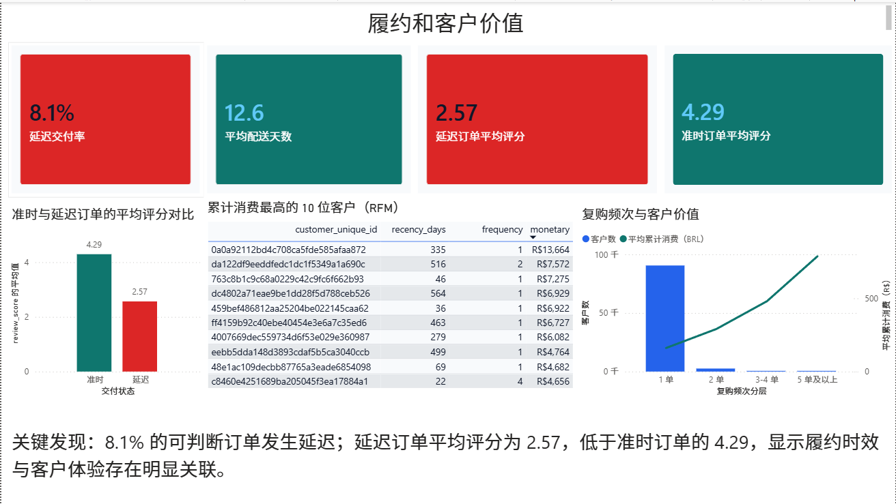

# Olist 电商经营分析

基于 Olist Brazilian E-Commerce Dataset 的端到端数据分析项目。项目从原始多表 CSV 出发，完成数据质量检查、Python 建模、MySQL 业务分析和 Power BI 仪表板，重点回答经营增长、收入来源、客户价值与履约体验问题。

## 仪表板

仪表板包含两页：

- **经营总览**：GMV、已交付订单、客单价、月度趋势、品类 GMV 前 10、州 GMV 前 7。
- **履约与客户价值**：延迟交付率、平均配送天数、准时/延迟订单评分对比，以及 RFM 高价值客户。

### 经营总览



### 履约与客户价值



## 业务问题

1. 已交付订单的 GMV、订单量和客单价如何随时间变化？
2. 哪些品类和州贡献了最多 GMV？
3. 哪些客户的消费价值最高？
4. 配送延迟与客户评价之间是否存在关联？

## 关键结果

| 指标 | 结果 | 口径 |
| --- | ---: | --- |
| 已交付 GMV | R$15.42M | 已交付订单的商品价格与运费之和 |
| 已交付订单 | 96,478 | `order_status = delivered` |
| 客单价 | R$159.83 | 已交付 GMV / 已交付订单数 |
| 平均配送时长 | 12.56 天 | 实际交付日 - 下单日；空值不计入平均值 |
| 延迟交付率 | 8.11% | 实际交付日晚于预计交付日的订单占可判断订单的比例 |
| 延迟订单平均评分 | 2.57 / 5 | 仅纳入可判断为延迟的已交付订单 |
| 准时订单平均评分 | 4.29 / 5 | 仅纳入可判断为准时的已交付订单 |

## 主要发现与建议

- GMV 在 2017 年快速增长，2018 年保持在较高水平；São Paulo（SP）是 GMV 贡献最高的州。
- Health & Beauty、Watches & Gifts 等品类的 GMV 贡献领先，应作为品类经营分析的优先对象。
- 延迟订单的平均评分显著低于准时订单（2.57 vs. 4.29），说明履约时效与客户体验存在明显关联。
- 可优先排查高订单量州和高 GMV 品类中的物流环节；当前数据为观察性数据，该关联不代表因果关系。

## 数据集与质量检查

数据来自 [Brazilian E-Commerce Public Dataset by Olist](https://www.kaggle.com/datasets/olistbr/brazilian-ecommerce)。第一阶段使用 7 张表：客户、订单、订单明细、支付、评价、商品、品类翻译。

- 所有关键表关联均未发现孤儿记录。
- `review_comment_title` 和 `review_comment_message` 缺失较多，未用于本阶段定量分析。
- 未交付或缺少实际/预计交付日期的订单不参与延迟交付判断。

完整字段说明和指标口径见 [数据字典](docs/data_dictionary.md)。

## 方法与数据模型

```text
原始 CSV
  → Python 质量检查
  → 订单级 / 订单明细级分析表
  → MySQL 查询与验证
  → Power BI 数据模型与仪表板
```

Python 生成三张分析表：

- `order_fact`：订单级事实表，用于 GMV、订单、履约与客户指标。
- `order_item_fact`：订单明细级事实表，用于品类表现。
- `rfm_customers`：客户级 RFM 表，用于客户价值分析。

Power BI 关系：

```text
rfm_customers[customer_unique_id] (1) → order_fact[customer_unique_id] (*)
order_fact[order_id] (1) → order_item_fact[order_id] (*)
```

## 项目结构

```text
olist-ecommerce-analysis/
├── data/
│   ├── raw/                       # Kaggle 原始 CSV（不提交）
│   └── processed/                 # 可再生的分析数据（不提交）
├── docs/
│   ├── data_dictionary.md
│   ├── mysql_setup.md
│   ├── power_bi_dashboard.md
│   └── power_bi_measures.dax
├── dashboard/
│   ├── olist_ecommerce_dashboard.pbix
│   └── olist_professional_theme.json
├── sql/
│   ├── 00_create_database.sql
│   ├── 01_schema.sql
│   └── 02_analysis_queries.sql
├── src/
│   ├── 01_data_quality.py
│   ├── 02_build_analysis_tables.py
│   └── 03_load_to_mysql.py
├── requirements.txt
└── README.md
```

## 本地复现

1. 从 Kaggle 下载数据集，解压全部 CSV 到 `data/raw/`。
2. 安装依赖：

   ```powershell
   python -m pip install -r requirements.txt
   ```

3. 运行质量检查和分析表构建：

   ```powershell
   python src/01_data_quality.py
   python src/02_build_analysis_tables.py
   ```

4. 如需 MySQL 分析，按 [MySQL 导入说明](docs/mysql_setup.md) 配置 `.env` 并导入数据。
5. 在 Power BI Desktop 导入 `data/processed/` 下的 3 张分析表；详细步骤见 [仪表板说明](docs/power_bi_dashboard.md)。

## 技术栈

Python · Pandas · NumPy · MySQL 8 · SQL · Power BI · DAX

## 参考

- 数据集：[Olist Brazilian E-Commerce Dataset](https://www.kaggle.com/datasets/olistbr/brazilian-ecommerce)
- 分析框架参考：[xuyfe/olist-ecommerce-analysis](https://github.com/xuyfe/olist-ecommerce-analysis)

本项目的数据处理、指标口径、SQL、Power BI 模型和业务结论均独立完成。
